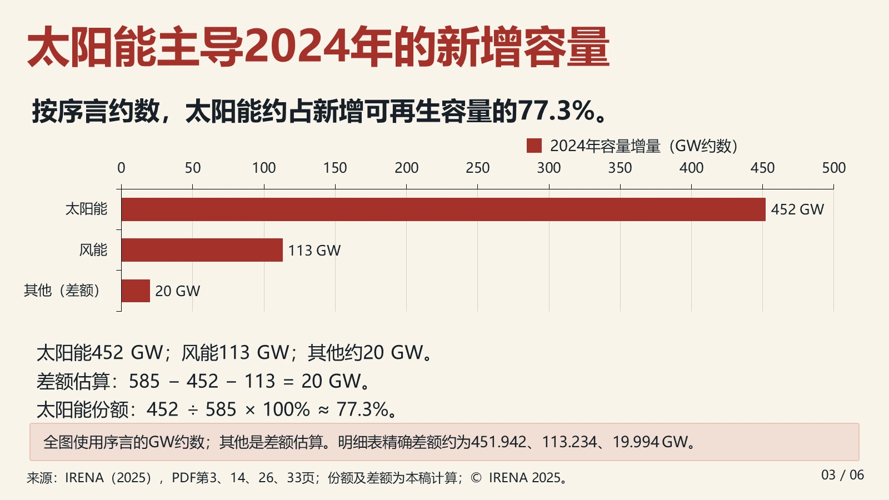
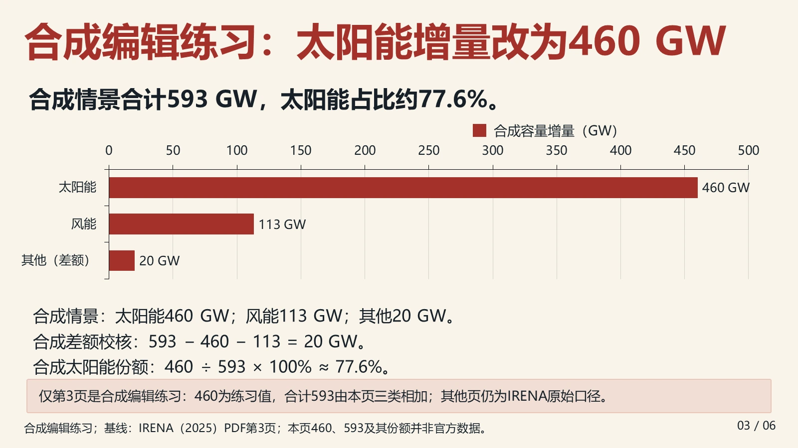
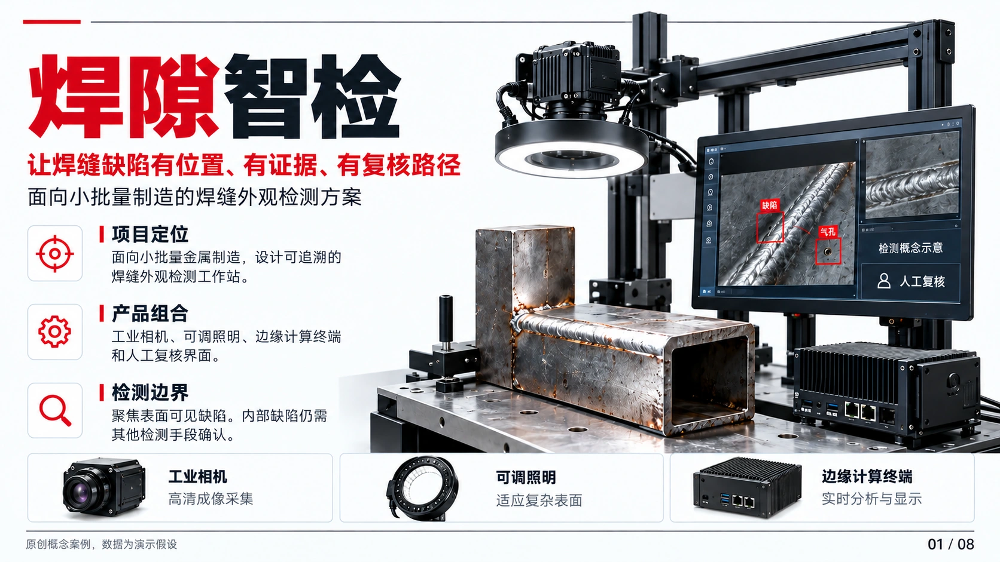
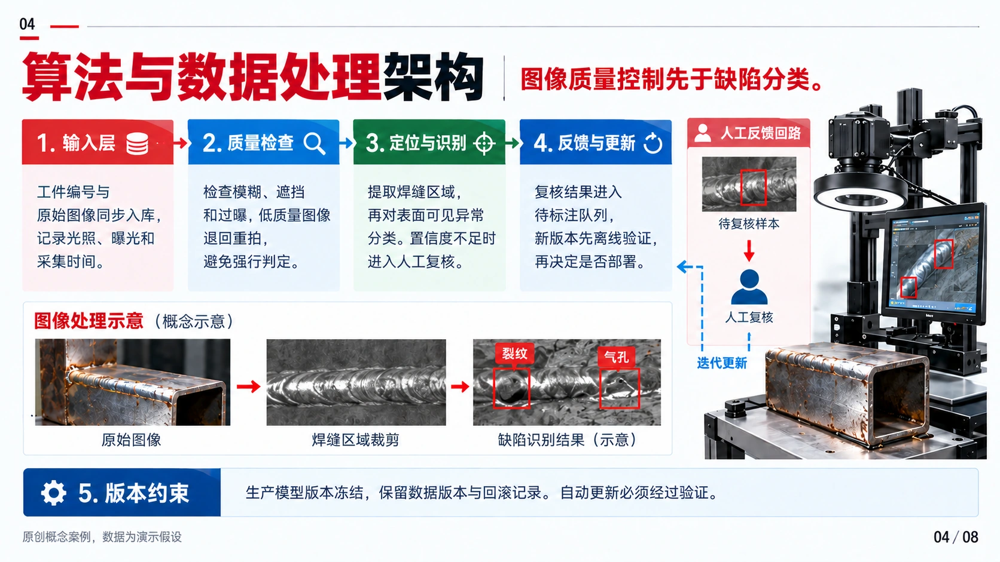
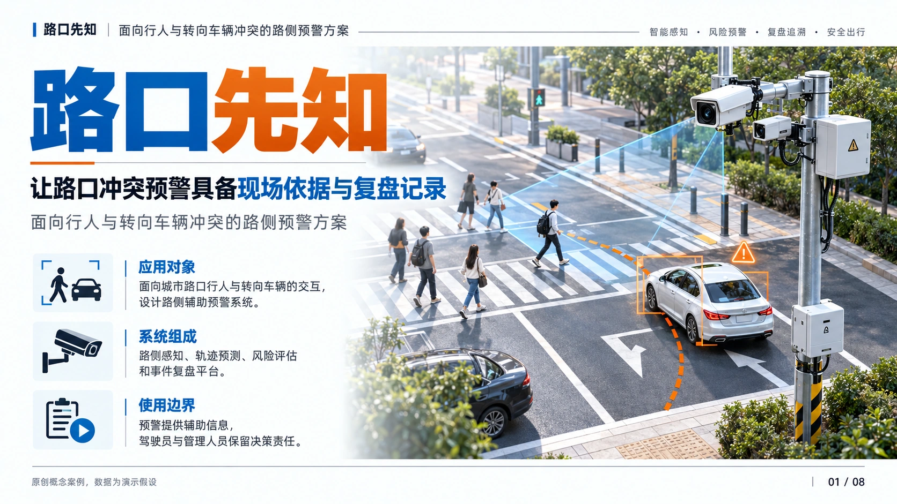
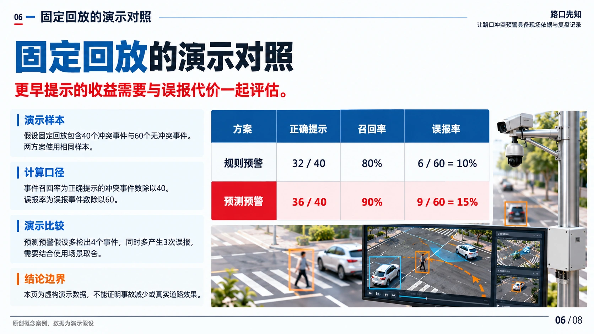
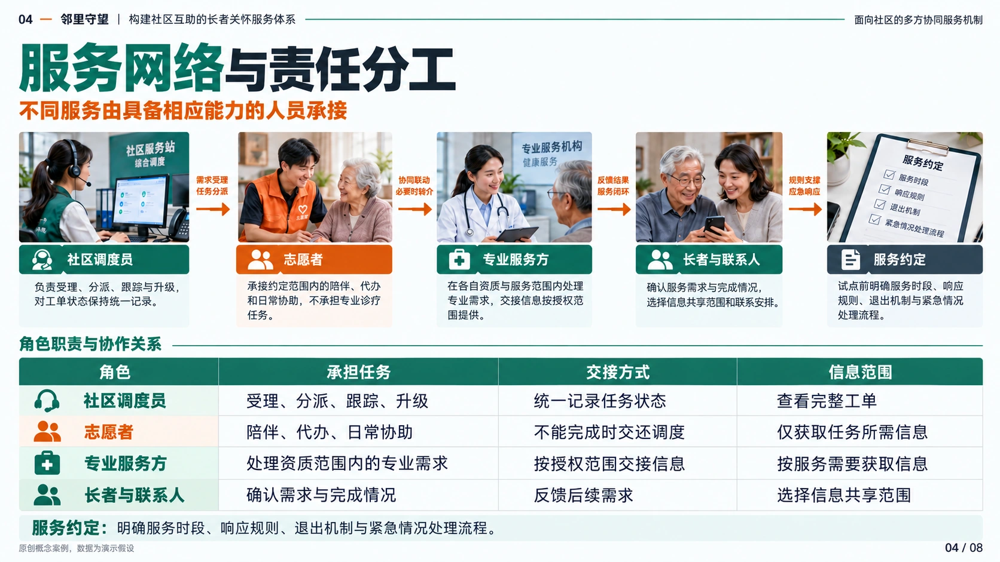

<div align="center">


# SlideMuse · Visual-first AI Presentation Skill

**Beautiful first. Editable when you need it.**

Turn books, PDFs, papers, and reports into a visually consistent image deck.<br>
Especially strong for **university competition presentations**—including Challenge Cup, the China International College Students' Innovation Competition, the National College Student Transportation Science and Technology Competition (交科赛), 3-Chuang, CP Cup, and innovation-training defenses—while also supporting **academic talks, thesis defenses, project pitches, course presentations, and cinematic slides**.<br>
Reconstruct slide images as native editable PowerPoint (PPTX) when needed.

[](https://github.com/helloo1568/slidemuse/actions/workflows/ci.yml)
[](CHANGELOG.md)
[](requirements.txt)
[](LICENSE)

[简体中文](README.md) · **English**

[Showcase](#showcase) · [Why SlideMuse](#features) · [Quick start](#quick-start) · [Guide](docs/guide.en.md) · [Contributing](CONTRIBUTING.md)

</div>

## Start with one message

**Recommended: send this one message to Codex, Claude Code, or OpenCode:**

```text
Install SlideMuse from https://github.com/helloo1568/slidemuse .
Run the repository's install.py to register the skill, install isolated dependencies, and verify the setup. If multiple clients are detected, pass --client for the one you are using.
```

Then say: `Use $slidemuse to turn this PDF into a 10-slide competition presentation.`

For manual installation and requirements, see [Quick start](#quick-start).

### What the current version supports

| Your task | Available capabilities |
| :--- | :--- |
| Create a presentation from source material | Slide-by-slide content drafts, four style overviews, image-based PPTX, and optional reconstruction into editable objects. |
| Keep your speaking content | Speaker notes in both image and editable decks, with optional source-linked Markdown export. |
| Revise chart data | Precise single-series or grouped bar/column figures; explicit data bindings synchronize declared charts, prose, and notes. |
| Continue an existing task | Input preflight, resumable stages, affected-page rendering, and a consolidated per-page action queue. |
| Review the deliverable | Object and content checks, scorecards bound to current files, and an optional offline per-page review panel. |

Current version: **2.16.1**. See the [changelog](CHANGELOG.md) for details. These tools support production and validation; actual content and visuals still need review.
2.16.0 adds bounded rendering, automatic environment invalidation and page-scoped dependency caching. Optional PowerPoint measurements locate text overflow and overlap. Real six-page backend controls and [production event logs](references/production-metrics.md) preserve repair cost and first-delivery outcomes; see the [pipeline guide](references/pipeline.md).


---

<a id="showcase"></a>

## See the results

### Editable sample · Download and try an edit

The six-slide Chinese IRENA overview contains **native text, one table and three charts with embedded workbooks**. The complete sample includes the source report, image/native decks, four independent editing exercises, a pinned runtime and reproduction commands.

<p align="center">
<a href="showcase/editable-irena/previews/editable-03.webp"></a>
<a href="showcase/editable-irena/previews/chart-edit.webp"></a>
</p>

<p align="center"><sub>Original native slide &nbsp; · &nbsp; Actual PowerPoint export after editing</sub></p>

[Editable PPTX](showcase/editable-irena/decks/editable.pptx?raw=true) · [Complete sample ZIP](showcase/editable-irena/sample.zip?raw=true) · [Edit demonstration](showcase/editable-irena/demo.mp4?raw=true) · [Reproduction guide](docs/editable-sample.en.md)

<sub>The original uses selected 2024 statistics and the 2025 report-time scenario; edited pages visibly identify synthetic practice values. Source report © IRENA 2025. Reproduction starts from approved images and structured inputs.</sub>

### Competition decks and visual styles

Three complete competition decks, **8 slides each**, alongside the Snowline Watch and Glaze Reborn showcases. Click any preview to view the full-size image.

[Browse all 24 competition slides](docs/competition-portfolio.md) · [Local portfolio browser](showcase/competition-portfolio/index.html)

### Weld Inspect · Manufacturing

A weld inspection concept for small-batch manufacturing, covering image capture, quality gates, human review, and comparative evaluation.

<p align="center">
<a href="showcase/competition-portfolio/assets/weld/01.webp"></a>
<a href="showcase/competition-portfolio/assets/weld/04.webp"></a>
</p>

<p align="center"><sub>01 / Project cover &nbsp; · &nbsp; 04 / Algorithm and data architecture</sub></p>

[View all 8 slides](docs/competition-portfolio.md#焊隙智检) · [Download image PPTX](showcase/competition-portfolio/decks/weld.pptx?raw=true)

### Junction Foresight · Transportation

A roadside warning concept for conflicts between pedestrians and turning vehicles, covering risk assessment, scenario validation, and false-alarm tradeoffs.

<p align="center">
<a href="showcase/competition-portfolio/assets/junction/01.webp"></a>
<a href="showcase/competition-portfolio/assets/junction/06.webp"></a>
</p>

<p align="center"><sub>01 / Project cover &nbsp; · &nbsp; 06 / Fixed-replay comparison</sub></p>

[View all 8 slides](docs/competition-portfolio.md#路口先知) · [Download image PPTX](showcase/competition-portfolio/decks/junction.pptx?raw=true)

### Neighbor Care · Community services

A community support concept for older adults living alone, covering human dispatch, responsibilities, service metrics, and ongoing operations.

<p align="center">
<a href="showcase/competition-portfolio/assets/neighbor/01.webp"></a>
<a href="showcase/competition-portfolio/assets/neighbor/04.webp"></a>
</p>

<p align="center"><sub>01 / Project cover &nbsp; · &nbsp; 04 / Service network and responsibilities</sub></p>

[View all 8 slides](docs/competition-portfolio.md#邻里守望) · [Download image PPTX](showcase/competition-portfolio/decks/neighbor.pptx?raw=true)

### Snowline Watch · Glacier blue & silver

A glacier inspection and ecological early-warning concept, covering the setting, problem, solution, and technology comparison.

<p align="center">
<a href="showcase/snowline-watch-01.png"></a>
<a href="showcase/snowline-watch-04.png"></a>
</p>

<p align="center"><sub>01 / Project cover &nbsp; · &nbsp; 04 / Technology comparison</sub></p>

### Glaze Reborn · Red & gold

A craft-themed competition concept connecting the problem, solution, and process technology through a red-and-gold palette.

<p align="center">
<a href="showcase/red-gold-competition-03.png"></a>
<a href="showcase/red-gold-competition-04.png"></a>
</p>

<p align="center"><sub>03 / Solution &nbsp; · &nbsp; 04 / Process technology</sub></p>

[View all 7 style samples](docs/style-showcase.md)

<sub>These are original concepts with synthetic demonstration data. Competition deck downloads are image-based PPTX files; style samples demonstrate visual output. Slide content is in Chinese.</sub>

<a id="features"></a>

## Why SlideMuse

| | What you get |
| :--- | :--- |
| **🎨 Choose a direction first** | Approve the content outline, then compare **4 slide-sorter overviews** using the same content before full production. |
| **🧩 Designed to keep editing** | Optional reconstruction into native text, shapes, tables, and **5 chart types**. Photos and complex artwork become separate, replaceable images. |
| **📝 Preserve approved content** | **Page Spec** records exact text, numbers, sources, and stable element IDs. Hash-bound visual transcripts can flag missing facts, and update plans identify affected slides. |
| **🔁 Resume and revise** | `deck-spec.md` tracks production state; `scene.json` stores layout. Update affected elements and assets, then export again. |
| **🔍 Inspect the deliverable** | Audit objects, text, table and chart data, stacking, and full-page background remnants; render every slide with a review sheet and optional source comparison, with a version-bound scorecard for regression checks. |
| **🔓 Open and adaptable** | **MIT licensed**, with support for agents that provide the required capabilities. Local Python tools make no network requests and need no API key. |

> **How it runs:** SlideMuse is an agent skill. The host reads materials, interprets images, and generates artwork; local scripts assemble, crop, compile, and audit. End-to-end production requires those host capabilities. See [runtime and model notes](references/models.md).

For accurate quantitative figures, generate [precise single-series or grouped bar/column references](references/chart-reliability.md). Optional [data dependency contracts](references/data-bindings.md) preview and synchronize chart values, derived arithmetic, prose and speaker notes; the [two-page synthetic transport example](examples/data-update/README.md) includes runnable commands.

Editable exports include [text overflow warnings](references/text-layout.md) for potentially crowded text boxes and table cells. The agent inspects actual renders before making changes; text is not automatically shrunk or removed. Conservative estimates do not replace visual review.

After rendering, the [offline per-page review panel](references/review-panel.md) lets you compare source and rendered images, save findings and issue locations, and avoid reusing stale conclusions after a slide changes. **The panel is optional; users do not need to fill it out slide by slide. An agent with visual capabilities can record checks after actually inspecting the images, or continue using the existing JSON workflow.** When using the panel, download the record (or copy the full exported text into a JSON file), import it, then rerun evaluation. Marking a check as passed does not automatically approve the deliverable.

## What can you make?

| Use case or style | How SlideMuse helps |
| :--- | :--- |
| **Competition PPT / competition presentations** | Connect the problem, solution, technical advantages, and applications in a consistent visual story. |
| **Challenge Cup / innovation competition / transportation competition / 3-Chuang / CP Cup** | Turn proposals, papers, research reports, business plans, and competition briefs into judge-oriented presentation narratives with a consistent visual system. |
| **Cinematic PPT / cinematic slides / poster-style presentations** | Explore cinematic lighting, scene composition, and poster-style covers through four visual directions. |
| **Academic presentations / thesis defense / research slides** | Extract questions, methods, results, and conclusions from papers and PDFs while preserving data and sources. |
| **Business presentations / project updates / course presentations / book presentations** | Adapt long source materials to the audience, slide count, and speaking context. |
| **AI presentation generation / PDF to PPT / image to editable PPTX** | Generate an image deck from source material, or reconstruct existing slide images and scanned PDF pages as editable objects. |

Cinematic, technology, and red-and-gold styles are visual directions you can request. Results depend on source material, the host's image capabilities, and slide-by-slide review.

### Specific competition presentation scenarios

Use project proposals, research papers, survey reports, and the current competition brief as source material. The examples below suggest ways to organize a presentation; confirm the outline against the requirements of your track.

| Competition | Search terms | Presentation focus |
| :--- | :--- | :--- |
| [中国国际大学生创新大赛](https://hudong.moe.gov.cn/srcsite/A08/s5672/202607/t20260731_1445670.html) | **大学生创新大赛 PPT / 互联网+ PPT / innovation pitch deck** | Problem, innovation, validation, team, and development plan. |
| [“挑战杯”全国大学生课外学术科技作品竞赛](https://www.tiaozhanbei.net/focus) | **挑战杯 PPT / 大挑 PPT / Challenge Cup research presentation** | Research question, methods, novelty, results, and applications. |
| [“挑战杯”中国大学生创业计划竞赛](https://www.tiaozhanbei.net/focus) | **小挑 PPT / Challenge Cup business plan presentation** | Customer needs, product, market, business model, and execution. |
| [全国大学生交通运输科技大赛（交科赛）](http://www.nactrans.net/) | **交科赛 PPT / transportation science & technology competition** | Transportation problem, solution design, technical route, validation, and innovation value. |
| [全国大学生电子商务“创新、创意及创业”挑战赛](https://www.3chuang.net/) | **三创赛 PPT / e-commerce competition presentation** | E-commerce context, ideas, operations, project results, and value. |
| [“正大杯”全国大学生市场调查与分析大赛](https://www.china-cssc.org/show-568-1912-1.html) | **正大杯 PPT / 市调大赛 PPT / market research presentation** | Research questions, survey design, data analysis, findings, and recommendations. |

Also useful for **大创 (undergraduate innovation and entrepreneurship training projects)**: proposal defenses, progress reports, and final presentations. These are project reporting scenarios, listed separately from competitions.

## Three stages, from source to delivery

| 01 · Content & style | 02 · Image deck | 03 · Editable reconstruction (optional) |
| :--- | :--- | :--- |
| Draft each slide, review content, then approve | Save Page Spec and generate each slide | Reconstruct layers from the spec and images |
| Compare four overviews and choose a style | Review text and visuals; assemble the PPTX | Compile native objects, audit, and render |
| **Approved production plan** | **Slide images + image-only PPTX** | **Editable PPTX + Scene + assets** |

Content approval precedes style selection by default. Stage 3 requires an explicit editable-deck request. Existing slide images or scanned PDFs can enter reconstruction directly. Preview skips and delegated choices follow the [full workflow rules](docs/guide.en.md).

The outline includes a reviewable draft for each slide: its claim, support, traceable evidence, interpretation, and actual visible content. Before style selection, the agent reviews content quality, then obtains approval or explicit authority to decide the content. Image generation preserves approved analysis and necessary qualifications. Covers and transitions stay concise; there is no universal word count or text ratio. See the [content-depth reference](references/content-outline.md) (Chinese).

<a id="quick-start"></a>

## Quick start

### 1. Check the requirements

| Stage | What you need |
| :--- | :--- |
| Installation and local scripts | **Python 3.10+**, plus Git for the clone command below. The installer creates an isolated environment and installs Python dependencies. |
| Source understanding and image generation | An agent with skill-file support, document reading, vision, image generation, and local file tools. The host provides the models and services. |
| PPTX rendering and visual review | Installed **PowerPoint** on Windows, or **LibreOffice + Poppler** with `soffice` and `pdftoppm` on PATH. The installer does not install these rendering tools. |

Use the installation prompt above, or follow the manual steps below.

### 2. Manual install: clone, then run one command

```sh
git clone https://github.com/helloo1568/slidemuse.git slidemuse
python slidemuse/install.py
```

The installer detects Codex, Claude Code, and OpenCode. It auto-selects only when exactly one client is detected; if multiple clients are present, it stops and asks you to pass `--client` so the skill is not installed into the wrong directory. It then copies the minimal runtime files, creates an isolated Python environment, installs dependencies, and validates the Page Spec example:

```sh
python slidemuse/install.py --client codex
python slidemuse/install.py --client claude
python slidemuse/install.py --client opencode
```

For upgrades, installation and validation happen in a temporary directory first. A failed upgrade keeps the previous version. If the installer finds a skill under the old name, it reports its location; remove it yourself after confirming `$slidemuse` works.

Keep source materials and deliverables in a separate working directory, not inside the installed skill.

### 3. Attach your material and ask

```text
Use $slidemuse to turn the attached report into a 10-slide project pitch.
The audience is competition judges. I have no style reference.
Show the content outline for approval, then four slide-sorter overviews for selection.
After I choose a style, create the image deck, then reconstruct an editable PPTX.
Include page-spec.json, scene.json, assets, and the editability report.
```

<details>
<summary>More examples: image-only decks / existing slide reconstruction</summary>

**Image-only classroom presentation:**

```text
Use $slidemuse to make a 12-slide classroom presentation from the attached material.
The audience is my classmates. No style reference; deliver only an image deck.
Confirm the outline first, then show four slide-sorter options for me to choose from.
```

**Make existing slide images editable:**

```text
Use $slidemuse starting at Step 3 to reconstruct all attached slide images as editable PPTX.
Preserve wording, aspect ratio, layout, and page order. Separate text, charts, and subjects.
Keep complex artwork as independent images, remove background remnants,
and deliver the Scene, assets, and editability report.
```

</details>

## What can you edit?

| Slide content | Reconstructed object | Editable properties |
| :--- | :--- | :--- |
| Headings, body text, labels, page numbers | Native text boxes | Text, font, color, position |
| Geometry, arrows, flow nodes | Native shapes, lines, groups | Size and style; ungroup to edit children |
| Tables | Native tables | Cell content and formatting |
| Column, bar, line, pie, doughnut charts | Native charts + embedded workbooks | Data and chart styling |
| Photos, people, complex illustrations | Separate image objects | Position, size, crop, replacement |

Complex artwork remains raster within each image. Recognition, segmentation, and background repair depend on host tools; the local scripts include no automatic OCR or segmentation model. Structural audits do not replace visual review or guarantee recovery of occluded information. See [capabilities and validation](docs/guide.en.md).

## Existing tasks: check, run, and resume

These commands operate on prepared specifications and assets. The host agent still handles content approval, image generation, and actual review; the pipeline coordinates compilation, rendering, and checks.

Run from the repository or installed skill root using a Python interpreter with the dependencies installed. The installed interpreter path is recorded in `.skill-python`. The example requires an existing `task/` directory containing `page-spec.json`, its referenced images, and, for editable mode, `scene.json` and its assets.

```sh
python scripts/init_deck.py task --mode editable
python scripts/run_deck.py task/job.json task-output --check
python scripts/run_deck.py task/job.json task-output
```

Use `--mode image` for image decks; no Scene is needed. Initialization refuses to overwrite an existing `job.json`. Missing images or approvals produce actionable diagnostics; fix them and rerun `--check` against the existing job. Repeat the last command after an interruption to resume. Unchanged pages can reuse renders and valid review records when cache conditions are met.

| Output | Purpose |
| :--- | :--- |
| `summary.md` / `summary.json` | Current status, per-page tasks, actual PPTX path, and tool-stage timings. |
| `review.png` / `render-report.json` | Page previews, reference comparisons, and rendering records; open full-size pages for details. |
| `review-panel.html` | Optional offline panel for the default review-record workflow, showing source and rendered images together. |
| `visual-review.json` / `content-observations.json` | Actual visual checks and text observations, which an agent can record directly. |
| `scorecard.json` | Current delivery-check results; editable mode also produces `object-audit.json`. |

`awaiting_review` (exit code 3) means review evidence is still pending. **Users do not need to fill out every page manually**: an agent with vision can record checks after actually inspecting the images. When using the panel, download or copy its exported JSON, import it, then rerun the original command to evaluate again. `complete` means the declared checks passed; it does not establish source truth or semantic correctness. Summaries and action descriptions are in Chinese, with stable machine-readable status fields. See [pipeline configuration, cache conditions, and exit codes](references/pipeline.md) and [review-panel import steps](references/review-panel.md).

## Documentation & community

| Your next step | Resource |
| :--- | :--- |
| Installation, workflow, commands, and validation | [Usage & technical guide](docs/guide.en.md) |
| Agent instructions | [SKILL.md](SKILL.md) |
| Preserve speaker notes and export a script | [Speaker notes](references/speaker-notes.md) |
| Build precise charts and update linked data | [Chart reliability](references/chart-reliability.md) · [Data bindings](references/data-bindings.md) · [Runnable example](examples/data-update/README.md) |
| Resume tasks and review delivery | [Pipeline](references/pipeline.md) · [Review panel](references/review-panel.md) · [Delivery evaluation](references/evaluation.md) |
| Content contracts and editable objects | [Page Spec](references/page-spec.md) · [Scene v1](references/scene-format.md) · [Reconstruction](references/reconstruction.md) |
| Versions and design references | [Changelog](CHANGELOG.md) · [Research](references/research.md) |
| Bug reports, suggestions, and code contributions | [Discussions](https://github.com/helloo1568/slidemuse/discussions) · [Contributing](CONTRIBUTING.md) |

### Credits & license

Thanks to [PPT Master by Hugo He](https://github.com/hugohe3/ppt-master), [banana-slides](https://github.com/Anionex/banana-slides), and [PPTAgent](https://github.com/icip-cas/PPTAgent) for methodological inspiration, and to Xiaoheihe author 玩家22186848 and Bilibili creator 一往无前河井 for their tutorials. The scene compiler is independently implemented; see [research notes](references/research.md) for attribution and tradeoffs.

Local scripts need no API key. Host image and vision services may receive supplied materials; their own pricing and privacy terms apply.

<div align="center">

**Start your next presentation with a good idea.**

If SlideMuse helps you, give it a Star or share your work and improvements.

[MIT License](LICENSE) © 2026 风清云影（[helloo1568](https://github.com/helloo1568)）

</div>
