# 国赛作品集

三套原创概念作品，每套8页。技术图解、验证口径、数据表与实施安排均在页面中呈现。

这些作品为图片版 PPTX。所有业务、技术和服务数据均为虚构演示输入，概念视觉不代表真实产品或部署。

[打开完整作品集](../showcase/competition-portfolio/index.html)

## 焊隙智检

面向小批量制造的焊缝外观检测方案

[下载图片版 PPTX](../showcase/competition-portfolio/decks/weld.pptx)

### 01 焊隙智检

### 02 小批量焊接的质检难点

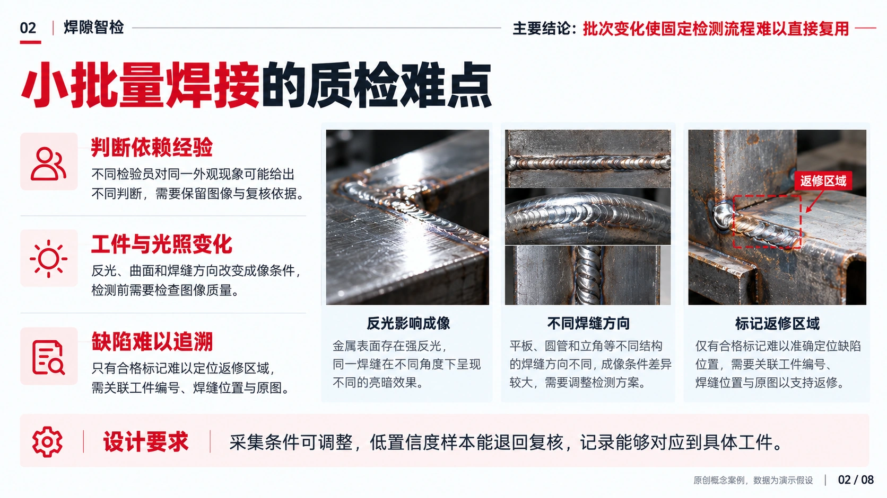

### 03 检测工作站与复核闭环

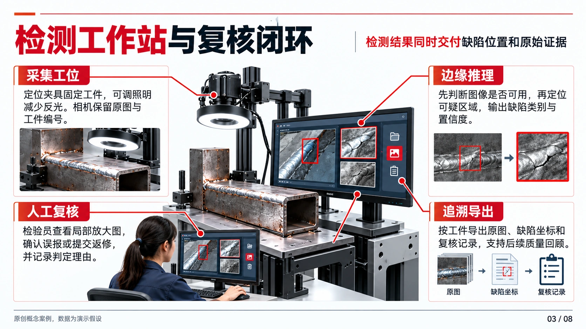

### 04 算法与数据处理架构

### 05 三项可检验的设计差异

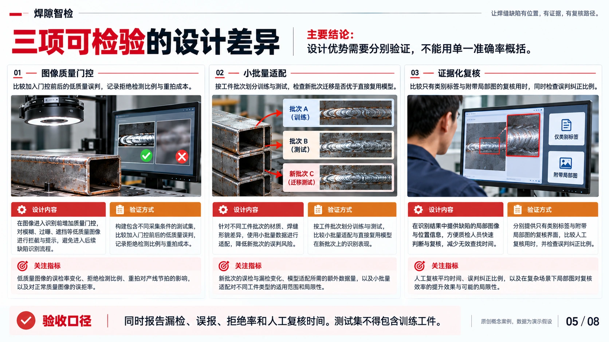

### 06 对照评测方案与演示数据

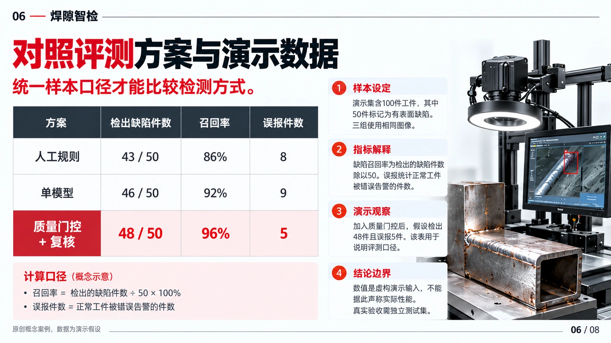

### 07 试点交付与维护责任

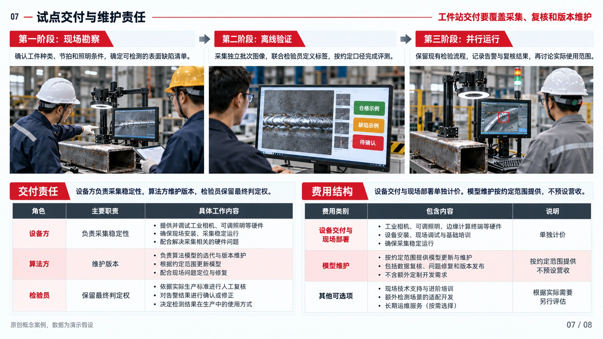

### 08 实施里程碑与主要风险

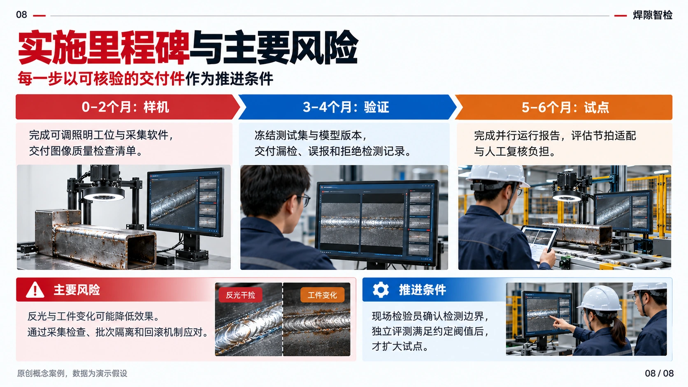

## 路口先知

面向行人与转向车辆冲突的路侧预警方案

[下载图片版 PPTX](../showcase/competition-portfolio/decks/junction.pptx)

### 01 路口先知

### 02 转向冲突的观察盲区

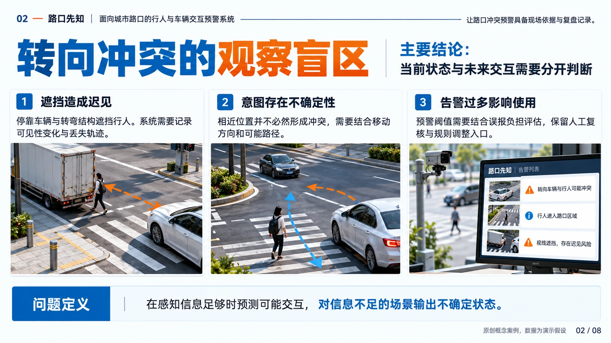

### 03 路侧预警与事件复盘

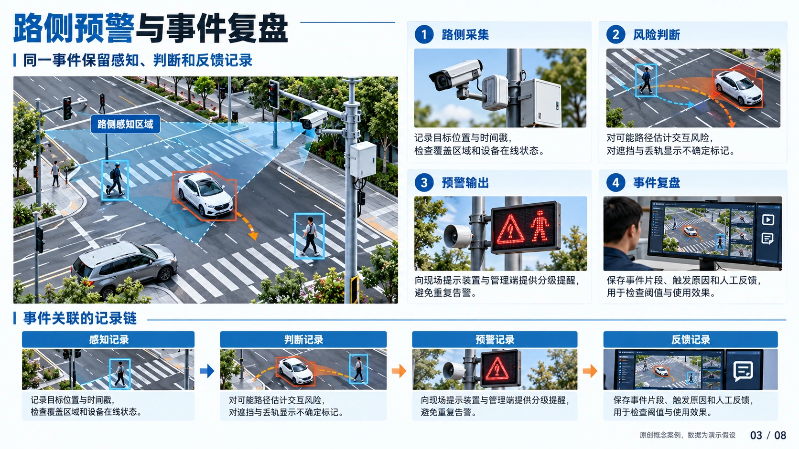

### 04 轨迹与风险判断架构

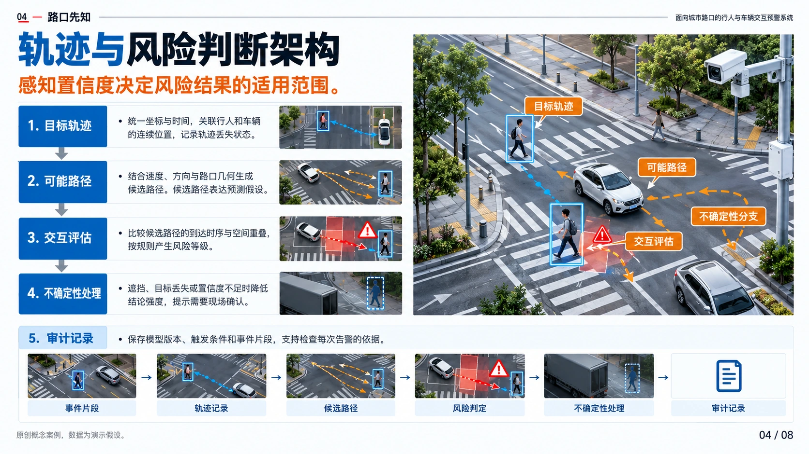

### 05 场景库与验证矩阵

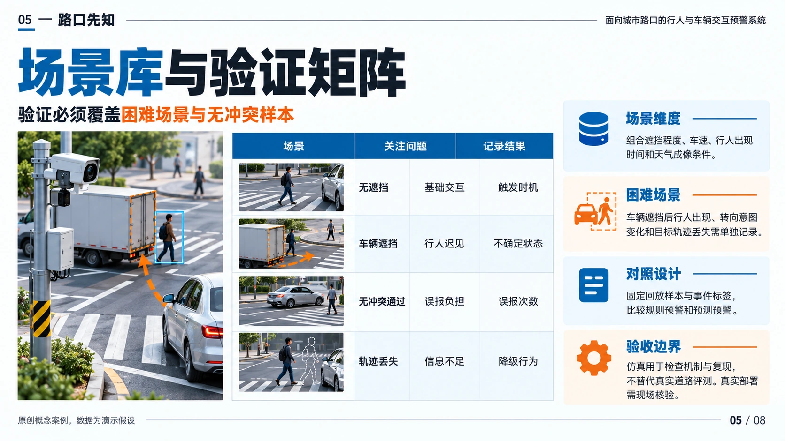

### 06 固定回放的演示对照

### 07 路口试点与运行保障

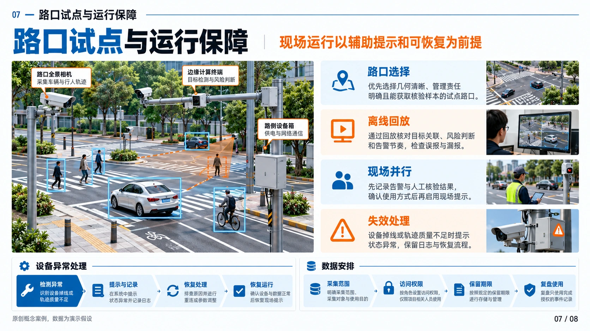

### 08 分阶段实施与验收交付

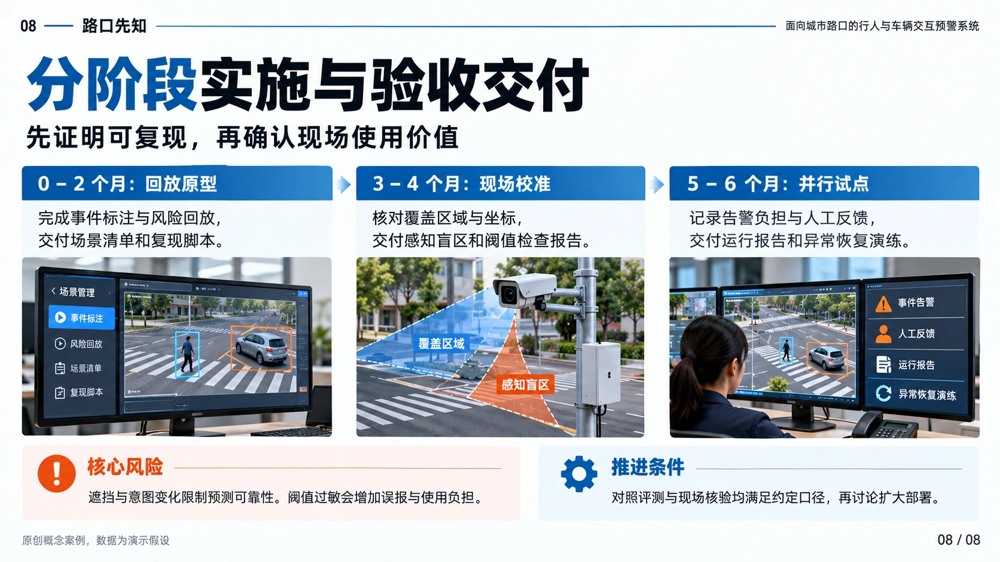

## 邻里守望

面向独居长者的社区支持服务方案

[下载图片版 PPTX](../showcase/competition-portfolio/decks/neighbor.pptx)

### 01 邻里守望

### 02 社区求助的服务断点

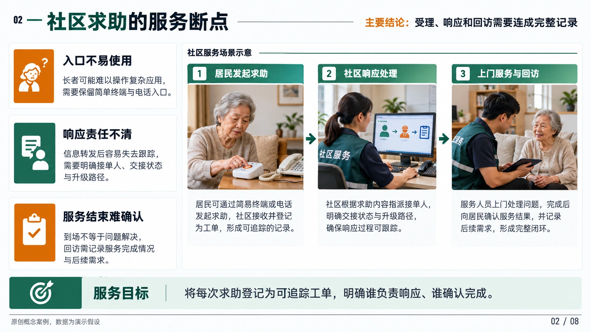

### 03 求助工单与人工调度

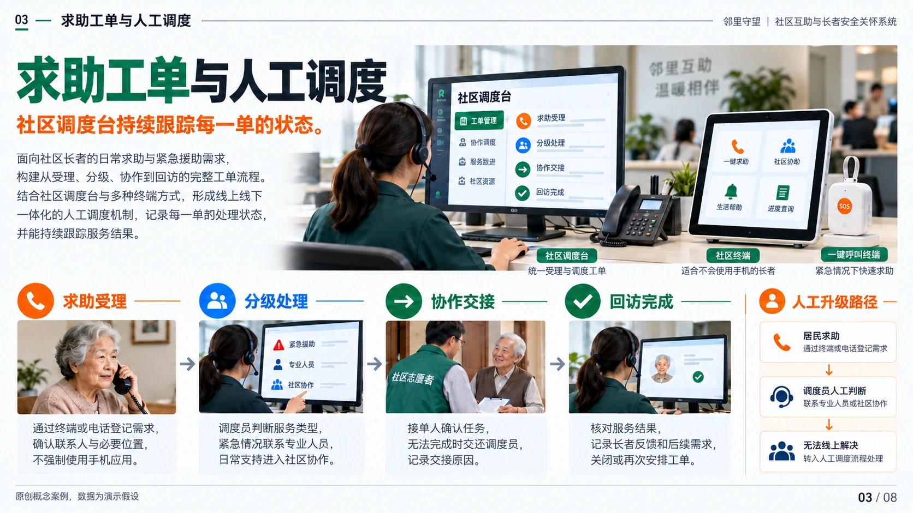

### 04 服务网络与责任分工

### 05 易用性与信息保护设计

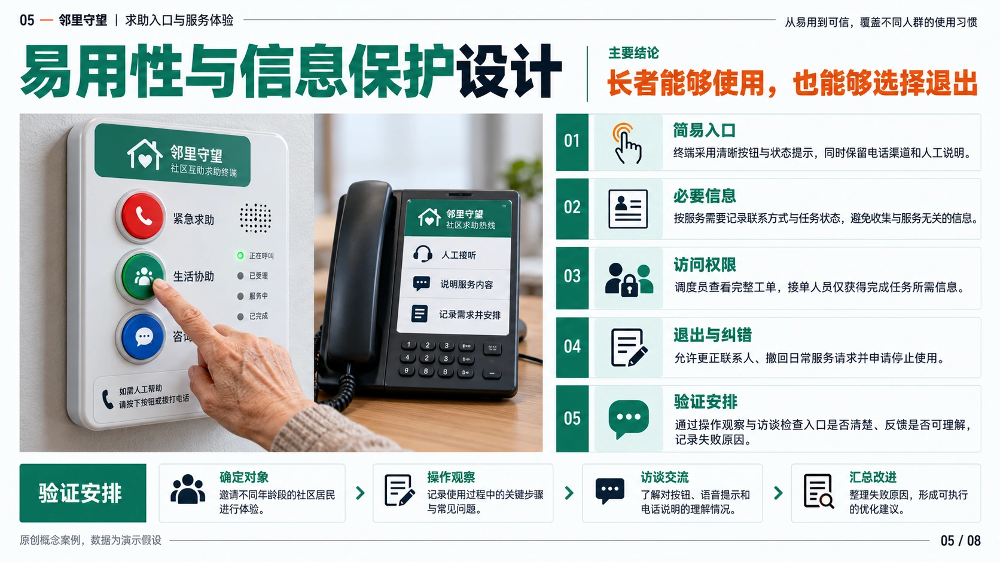

### 06 试点指标与演示账本

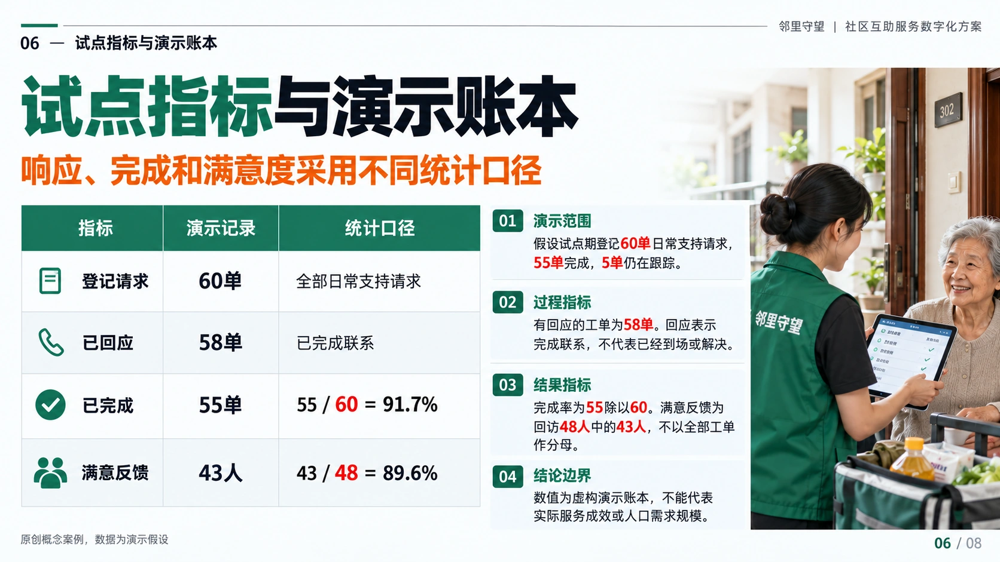

### 07 服务运营与成本结构

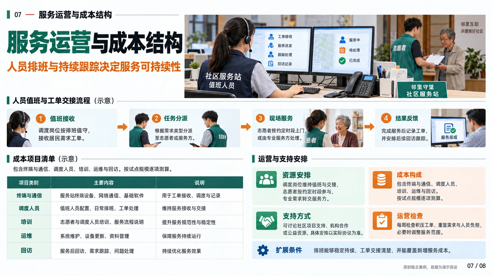

### 08 试点推进与服务风险

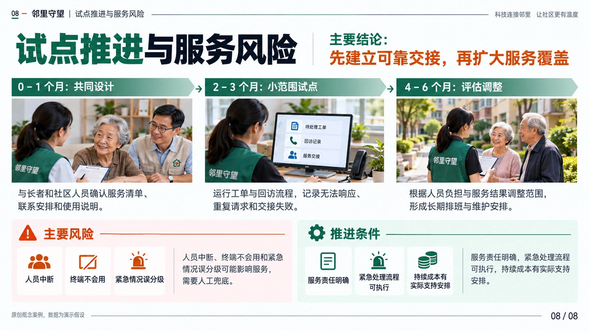
